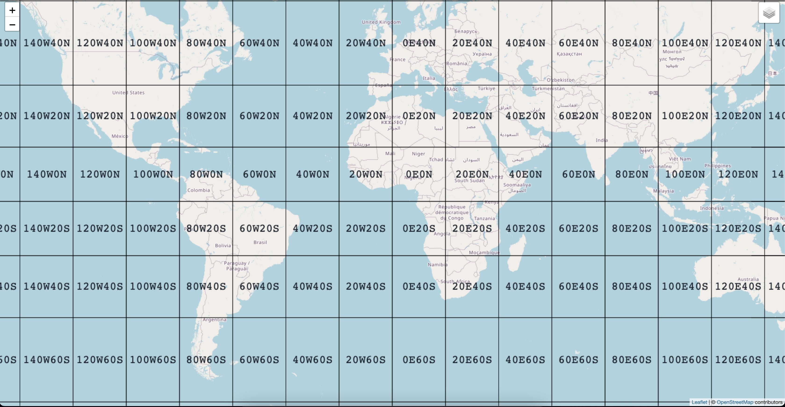

# Leaflet.GARS


[](https://github.com/prettier/prettier)

This is a standalone angular app used to test the Global Area Reference System [GARS](https://github.com/ngageoint/gars-js) library from the [National Geospatial-Intelligence Agency (NGA)](http://www.nga.mil/). 



## Dependencies

This app tries to mirror the angular and leaflet dependencies found in [MAGE](https://github.com/ngageoint/mage-server).  More specifically, this means:
1.  Angular 1.5
2.  Leaflet 1.7

## Build and Installation

To run the test:
1.  Clone the repository
2.  ```npm ci```
3.  ```npm run build```
4.  ```npm run start```
5.  http://localhost:4200